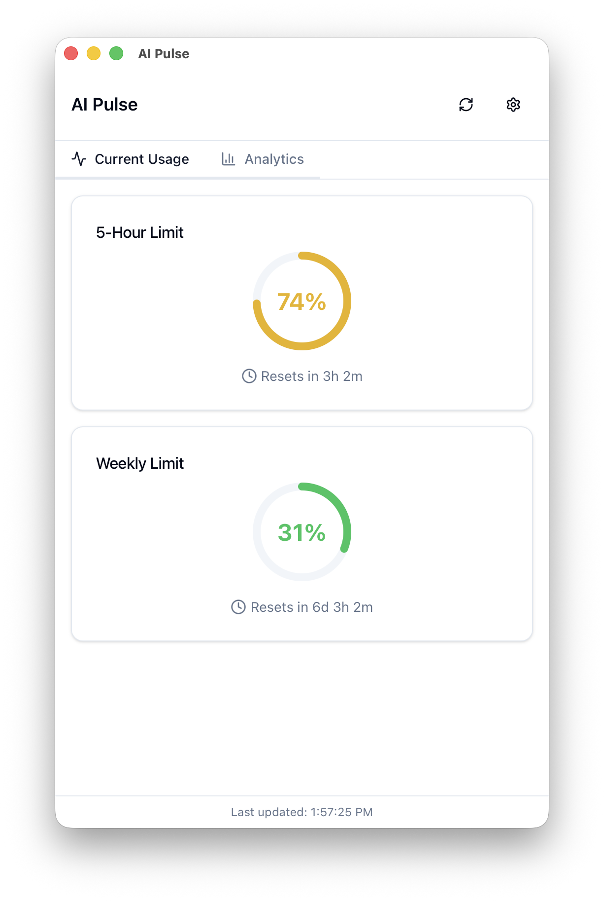

# AI Pulse

A cross-platform desktop application for monitoring AI service usage quotas (Claude for now).

<p align="center">
  
  
</p>

## Features

- **Real-time Usage Tracking** - Monitor your Claude API usage limits
- **System Tray Integration** - Dynamic progress ring icon shows usage at a glance
- **Smart Notifications** - Alerts at 50%, 75%, 90% usage thresholds
- **Background Refresh** - Automatic updates with adaptive intervals
- **Cross-platform** - macOS, Linux, Windows

## Quick Start

### Prerequisites

- [Node.js](https://nodejs.org/) 18+
- [Rust](https://rustup.rs/) toolchain

```bash
# Install dependencies
npm install

# Start development server
npm run tauri dev
```

### Configure Credentials

1. Click the **Settings** icon (gear) in the app header
2. Enter your Claude credentials:
   - **Organization ID**: Found in your Claude.ai URL (`claude.ai/settings/organization/[org-id]`)
   - **Session Key**: Found in browser DevTools → Application → Cookies → `sessionKey`
3. Click **Save Credentials**

## Tech Stack

- **Tauri v2** - Cross-platform framework (Rust backend)
- **React 19 + TypeScript** - Frontend UI
- **shadcn/ui + Tailwind CSS v4** - Components and styling
- **Zustand** - State management

## Development

```bash
# Run in development (with hot reload)
npm run tauri dev

# Build for production
npm run tauri build

# Check Rust compilation
cargo check --manifest-path src-tauri/Cargo.toml
```

### Project Structure

```
src/                    # React frontend
├── components/         # UI components
├── hooks/              # Custom React hooks
└── lib/                # Utilities and Tauri bindings

src-tauri/src/          # Rust backend
├── commands/           # Tauri command handlers
├── providers/          # API adapters (Claude, Codex)
└── services/           # Business logic (scheduler, notifications)
```

## Support

<a href="https://buymeacoffee.com/griffinthomas">
  
</a>

## License

MIT
